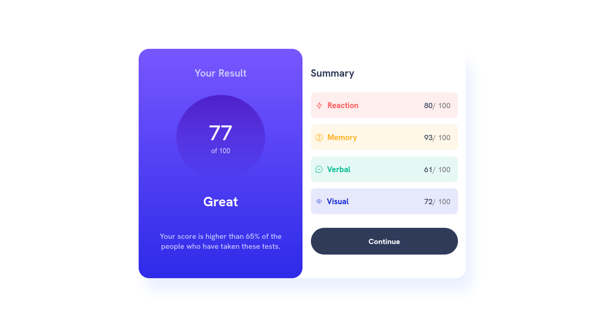
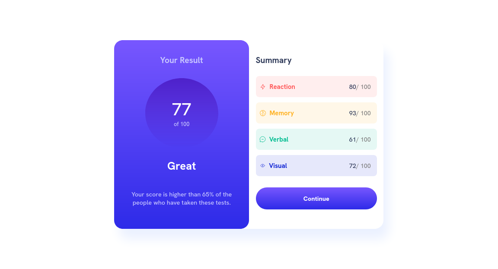
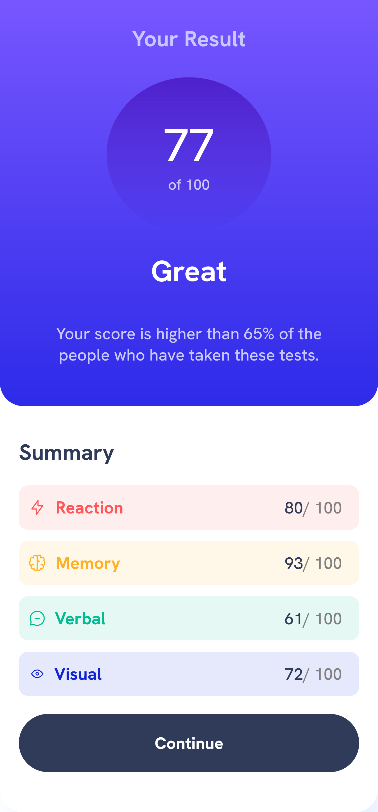

# Frontend Mentor - Results summary component solution

This is a solution to the [Results summary component challenge on Frontend Mentor](https://www.frontendmentor.io/challenges/results-summary-component-CE_K6s0maV). Frontend Mentor challenges help you improve your coding skills by building realistic projects. 

## Table of contents

- [Overview](#overview)
  - [The challenge](#the-challenge)
  - [Screenshot](#screenshot)
  - [Links](#links)
- [My process](#my-process)
  - [Built with](#built-with)
  - [What I learned](#what-i-learned)
- [Author](#author)

### The challenge

Users should be able to:

- View the optimal layout for the interface depending on their device's screen size
- See hover and focus states for all interactive elements on the page

### Screenshot

### Links

- Solution URL: [solution URL](https://www.frontendmentor.io/solutions/responsive-resultsummary-component-using-html-css-flex-and-grid-and-js-7OSq0FjYvc)
- Live Site URL: [live site URL](https://yassine-ramla.github.io/Frontend-Mentor_Results-summary-component/)

### Built with

- CSS custom properties
- Flexbox
- CSS Grid

### What I learned

what i've learnt building this component is some new ways to handle the dementions of elements and how to read data from json files and display it on the page

## Author

- Frontend Mentor - [@yassine-ramla](https://www.frontendmentor.io/profile/yassine-ramla)